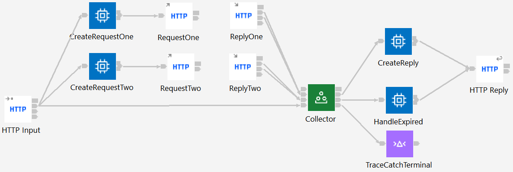
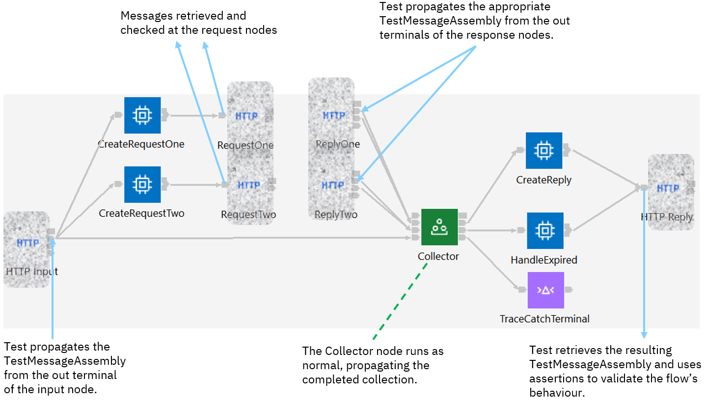
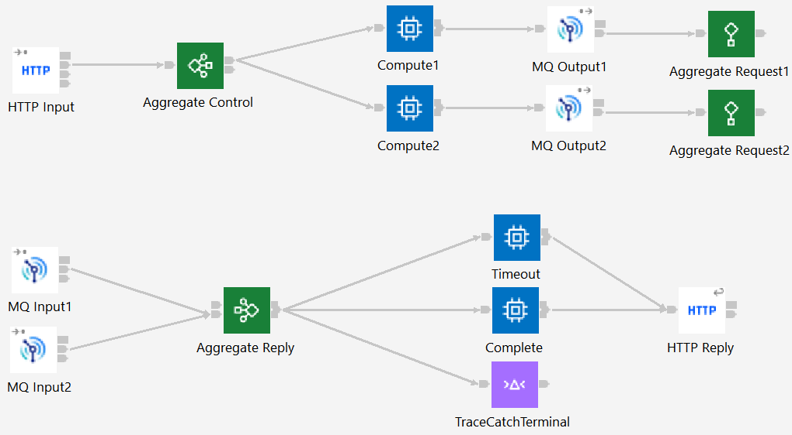
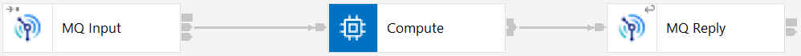
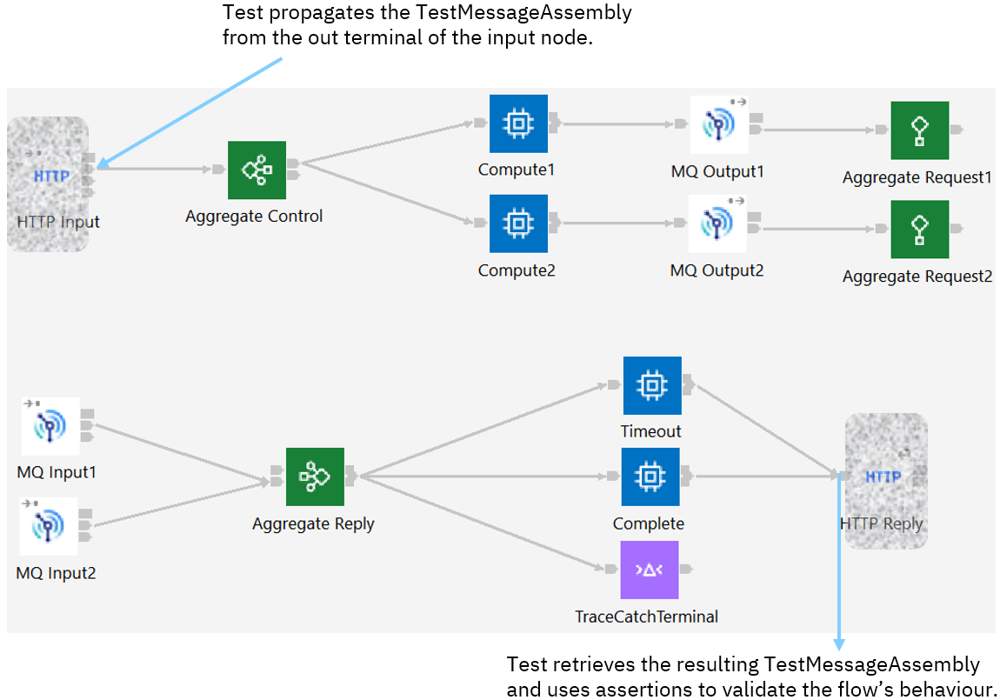
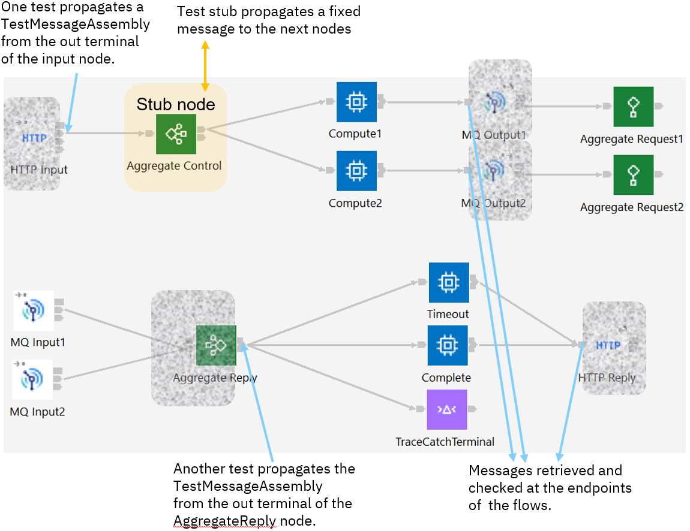

# ace-scatter-gather-test-examples
Examples of using ACE testing with scatter-gather patterns (Aggregation, etc)

This repo containes examples for Aggregation and Collector nodes. Groups nodes could be added, and would look
very similar to the Aggrgeation example except that no queue manager would be needed for the nodes themselves.

The tests are split between "unit tests" and "component tests", with the key distinction between the two being
that unit tests must run without prereq services (such as MQ or REST APIs). See https://community.ibm.com/community/user/integration/blogs/trevor-dolby/2023/03/20/app-connect-enterprise-ace-unit-and-component-test for a fuller description of the differences and reasons for the split.

## Prereqs

ACE 12.0.8 or later is required, and IBM MQ is also required for the component tests (and the applications 
themselves if not running in unit test mode). The queue manager is assumed to be named `ACEv12_QM` but this 
can be changed in the scripts and launch configurations. The `sg-queues.mqsc` file should be fed into runmqsc
to create the needed application queues, and the usual iib_createqueues script run also.

# Collector example

The example application calls two REST APIs using Async nodes, and collects the responses along with a copy
of the original message to create the reply. The application logic is very simple, as it is designed to show
the overall testing strategies rather than application design, and the overall flow looks as follows:

In order to reduce pre-reqs, the ACE REST /apiv2 endpoint (on port 7600) is used in place of an actual backend
flow, but the approach would work with actual REST APIs as well. [Unit testing](CollectorApplication_UnitTest)
covers only one of the Compute node, but could be extended, and does not require MQ.

Component tests do require MQ, and come in two flavors: the `httpInvokeTest` runs the flow end-to-end using a
Java HTTP client, while the `withMockAPISuccessTest` stubs out the REST API and uses recorded responses instead:

# Aggregation example

The example application calls two MQ flows provided by the [BackendApplication](BackendApplication), and 
aggregates the responses to create the HTTP replymessage . The application logic is very simple, as it is designed 
to show the overall testing strategies rather than application design, and the overall flow looks as follows:

The BackendApplication contains two very simple flows, both of which look as follows:

[Unit testing](AggregationApplication_UnitTest) requires two tests, with one test for each leg of the flow

- The first test uses a stub to avoid requiring MQ to be available for the Aggregate Control node, and validates the MQ output messages are as expected. 
- The second test starts at the output terminal of the Aggregate Reply node, and sends a pre-recorded message to the downstream nodes.

Other tests would normally be needed to cover any transformation performed between the MQInput nodes and the Aggregate 
Reply node, but this flow is so simple those tests are not implemented.

Component testing is conceptually simpler, in that it runs an end-to-end test without any stub nodes, but 
does require both MQ and the BackendApplication to be available in order to succeed:

